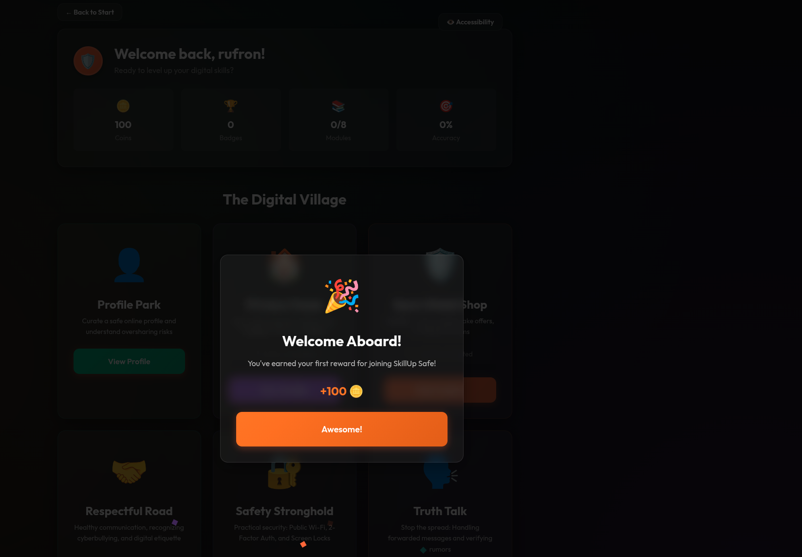

# SkillUp Safe 🛡️

A mobile-first, gamified educational platform designed to empower vulnerable communities in Africa with essential digital literacy and safety skills.

## 🎯 The Problem

Many digital literacy resources are generic, not engaging, and fail to address the specific, culturally-relevant threats faced by women, girls, and other vulnerable groups online. This gap leaves them exposed to digital violence, scams, and privacy violations.

## 💡 Our Solution

**SkillUp Safe** transforms digital safety education from a boring lecture into an engaging adventure. We use interactive games, quizzes, and role-playing scenarios set in a relatable "Digital Village" to teach users how to:

*   🎣 Spot phishing scams and fake offers.
*   🔒 Manage privacy settings on social media.
*   🚷 Recognize and respond to online grooming and harassment.
*   📢 Identify misinformation and fake news.
*   💬 Practice safe and respectful online communication.

By making learning fun and accessible, we empower users to navigate the digital world with confidence.

## ✨ Unique Value Proposition

*   **Gamified Learning:** Interactive modules and a reward system (badges, points, avatar customization) boost engagement and knowledge retention.
*   **Culturally Tailored:** Content is specifically designed for diverse African communities, addressing local platforms, common scam tactics, and social contexts.
*   **User-Centric Design:** A focus on the unique threats faced by women and girls, with inclusive design for all users.
*   **Proactive Prevention:** Shifts the focus from reacting to harm to proactively building digital resilience.

## 🎮 Core Features

*   **Personalized Onboarding:** Users set their comfort level and preferences for a tailored experience.
*   **The Digital Village:** A visual map where each building represents a key learning module (e.g., Privacy House, Scam Shield Shop).
*   **Interactive Modules:**
    *   **Quizzes:** "Spot the Fake" messages and emails.
    *   **Simulations:** Practice in a safe, simulated environment.
    *   **Boss Battles:** Role-playing scenarios to test skills against a "Scam Master" or "Harasser."
*   **Reward System:** Earn "Safe-Coins" and badges to customize your in-app avatar.
*   **Progress Tracking:** Visual progress bars to motivate continued learning.

## 🛠️ Tech Stack

*   **Frontend:** React Native / Flutter (for cross-platform mobile development)
*   **Backend:** Node.js / Python (Django/Flask)
*   **Database:** Firebase / PostgreSQL
*   **State Management:** Redux / Provider
*   **Version Control:** Git & GitHub

## 🚀 Getting Started

### Prerequisites

*   Node.js / Python
*   npm / yarn / pip
*   A mobile emulator or physical device for testing.

### Installation

1.  Clone the repo
    ```bash
    git clone https://github.com/your-username/skillup-safe.git
    cd skillup-safe
    ```
2.  Install NPM packages (example for a React Native project)
    ```bash
    npm install
    ```
3.  (For iOS)
    ```bash
    cd ios && pod install && cd ..
    ```
4.  Start the development server
    ```bash
    npx react-native run-android
    # or
    npx react-native run-ios
    ```

## 📱 Project Screenshots (To be Added)

| Onboarding | Digital Village Map | Quiz Module |



## 🤝 How to Contribute

We love contributions! Whether you're a developer, designer, or content creator, you can help make SkillUp Safe better.

1.  Fork the Project
2.  Create your Feature Branch (`git checkout -b feature/AmazingFeature`)
3.  Commit your Changes (`git commit -m 'Add some AmazingFeature'`)
4.  Push to the Branch (`git push origin feature/AmazingFeature`)
5.  Open a Pull Request

Please read our `CONTRIBUTING.md` for details on our code of conduct and the process for submitting pull requests.

## 📄 License

This project is licensed under the MIT License - see the [LICENSE](LICENSE) file for details.

## 👥 The Team

This project was built with ❤️ by:

| Name | Role | Contact |
| :--- | :--- | :--- |
| **Abigael Cheptoo** | Project Lead / Content | +254706560495 |
| **Abdulrahman Daud** | Backend Developer | +2349012973273 |
| **Brian Kipchumba** | Full-Stack Developer | +254757710514 |
| **Newton Kiogora** | Mobile Developer | +254745395981 |
| **Dorcas Wanjiru** | UI/UX Designer | +254740713823 |
| **Dvock Akoi** | DevOps / QA | +254704387762 |

## 🙏 Acknowledgments

*   Inspired by the "16 Days of Activism against Gender-Based Violence" and the "Power Hacks 2025" hackathon.
*   Icons and assets from [FlatIcon](https://www.flaticon.com/) and [Unsplash](https://unsplash.com/).